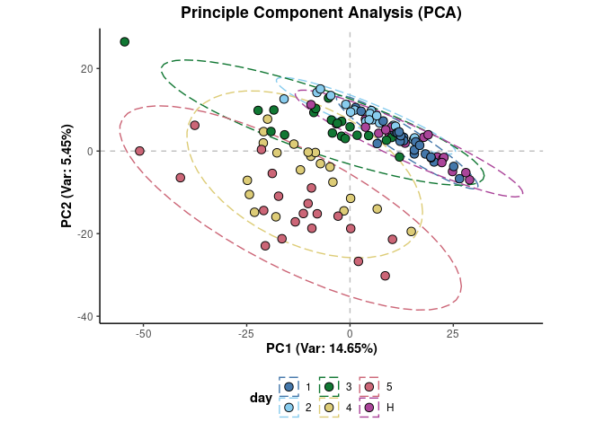

<!-- README.md is generated from README.Rmd. Please edit that file -->

# metabolyseR

<!-- badges: start -->

[](https://lifecycle.r-lib.org/articles/stages.html#experimental)
[](https://github.com/jasenfinch/metabolyseR/actions)
[](https://codecov.io/gh/jasenfinch/metabolyseR/branch/master)
[](https://github.com/jasenfinch/metabolyseR/blob/master/DESCRIPTION)
[](https://zenodo.org/badge/latestdoi/88983134)
[](https://GitHub.com/jasenfinch/metabolyseR/releases/)
<!-- badges: end -->

> **A tool kit for pre-treatment, modelling, feature selection and
> correlation analyses of metabolomics data.**

## Overview

This package provides a tool kit of methods for metabolomics analyses
that includes:

-   data pre-treatment
-   multivariate and univariate modelling/data mining techniques
-   correlation analysis

## Installation

The `metabolyseR` package can be installed from GitHub using the
following:

``` r
devtools::install_github('jasenfinch/metabolyseR',build_vignettes = TRUE)
```

## Learn more

The package documentation can be browsed online at
<https://jasenfinch.github.io/metabolyseR/>.

If this is your first time using `metabolyseR` see the
[Introduction](https://jasenfinch.github.io/metabolyseR/articles/metabolyseR.html)
vignette or the quick start analysis below for information on how to get
started.

If you believe you’ve found a bug in `metabolyseR`, please file a bug
(and, if possible, a [reproducible
example](https://reprex.tidyverse.org)) at
<https://github.com/jasenfinch/metabolyseR/issues>.

## Quick start example analysis

This example analysis will use the `abr1` data set from the
[metaboData](https://aberhrml.github.io/metaboData/) package. It is
nominal mass flow-injection mass spectrometry (FI-MS) fingerprinting
data from a plant-pathogen infection time course experiment. The
analysis will also include use of the pipe `%>%` from the
[magrittr](https://magrittr.tidyverse.org/) package. First load the
necessary packages.

``` r
library(metabolyseR)
library(metaboData)
```

For this example we will use only the negative acquisition mode data
(`abr1$neg`) and sample meta-information (`abr1$fact`). Create an
`AnalysisData` class object using the following:

``` r
d <- analysisData(abr1$neg,abr1$fact)
```

The data includes 120 samples and 2000 mass spectral features as shown
below.

``` r
d
#> 
#> AnalysisData object containing:
#> 
#> Samples: 120 
#> Features: 2000 
#> Info: 9
```

The `clsAvailable()` function can be used to identify the columns
available in our meta-information table.

``` r
clsAvailable(d)
#> [1] "injorder" "pathcdf"  "filecdf"  "name.org" "remark"   "name"     "rep"     
#> [8] "day"      "class"
```

For this analysis, we will be using the infection time course class
information contained in the `day` column. This can be extracted and the
class frequencies tabulated using the following:

``` r
d %>%
  clsExtract(cls = 'day') %>%
  table()
#> .
#>  1  2  3  4  5  H 
#> 20 20 20 20 20 20
```

As can be seen above, the experiment is made up of six infection time
point classes that includes a healthy control class (`H`) and five day
infection time points (`1-5`), each with 20 replicates.

For data pre-treatment prior to statistical analysis, a two-thirds
maximum class occupancy filter can be applied. Features where the
maximum proportion of non-missing data per class is above two-thirds are
retained. A total ion count normalisation will also be applied.

``` r
d <- d %>%
  occupancyMaximum(cls = 'day', occupancy = 2/3) %>%
  transformTICnorm()
```

``` r
d
#> 
#> AnalysisData object containing:
#> 
#> Samples: 120 
#> Features: 1760 
#> Info: 9
```

This has reduced the data set to 1760 relevant features.

The structure of the data can be visualised using both unsupervised and
supervised methods. For instance, the first two principle components
from a principle component analysis (PCA) of the data with the sample
points coloured by infection class can be plotted using:

``` r
plotPCA(d,cls = 'day',xAxis = 'PC1',yAxis = 'PC2')
```



And similarly, multidimensional scaling (MDS) of sample proximity values
from a supervised random forest classification model along with receiver
operator characteristic (ROC) curves.

``` r
plotSupervisedRF(d,cls = 'day')
```


A progression can clearly be seen from the earliest to latest infected
time points.

For feature selection, one-way analysis of variance (ANOVA) can be
performed for each feature to identify features significantly
explanatory for the infection time point.

``` r
anova_results <- d %>%
  anova(cls = 'day')
```

A table of the significantly explanatory features can be extracted with
a bonferroni correction adjusted p value &lt; 0.05 using:

``` r
explan_feat <- explanatoryFeatures(anova_results,threshold = 0.05)
```

``` r
explan_feat
#> # A tibble: 379 × 10
#>    Response Comparison  Feature term      df    sumsq  meansq statistic  p.value
#>    <chr>    <chr>       <chr>   <chr>  <dbl>    <dbl>   <dbl>     <dbl>    <dbl>
#>  1 day      1~2~3~4~5~H N341    respo…     5  3.88e-4 7.76e-5     137.  1.55e-46
#>  2 day      1~2~3~4~5~H N133    respo…     5  7.00e-5 1.40e-5     126.  8.63e-45
#>  3 day      1~2~3~4~5~H N163    respo…     5  6.01e-5 1.20e-5     117.  2.95e-43
#>  4 day      1~2~3~4~5~H N1087   respo…     5  2.42e-6 4.84e-7      99.8 5.61e-40
#>  5 day      1~2~3~4~5~H N171    respo…     5  2.25e-7 4.50e-8      95.7 3.84e-39
#>  6 day      1~2~3~4~5~H N513    respo…     5  3.38e-6 6.76e-7      95.3 4.78e-39
#>  7 day      1~2~3~4~5~H N1025   respo…     5  2.78e-6 5.56e-7      91.0 3.91e-38
#>  8 day      1~2~3~4~5~H N342    respo…     5  3.71e-6 7.41e-7      90.3 5.32e-38
#>  9 day      1~2~3~4~5~H N1083   respo…     5  5.11e-5 1.02e-5      89.0 1.06e-37
#> 10 day      1~2~3~4~5~H N1085   respo…     5  1.10e-5 2.19e-6      83.4 1.92e-36
#> # … with 369 more rows, and 1 more variable: adjusted.p.value <dbl>
```

The ANOVA has identified 379 features significantly explanatory over the
infection time course. A heat map of the mean relative intensity for
each class of these explanatory features can be plotted to visualise
their trends between the infection time point classes.

``` r
plotExplanatoryHeatmap(anova_results,
                       threshold = 0.05,
                       featureNames = FALSE)
```


Many of the explanatory features can be seen to be most highly abundant
in the final infection time point `5`.

Finally, box plots of the trends of individual features can be plotted,
such as the `N341` feature below.

``` r
plotFeature(anova_results,feature = 'N341',cls = 'day')
```


