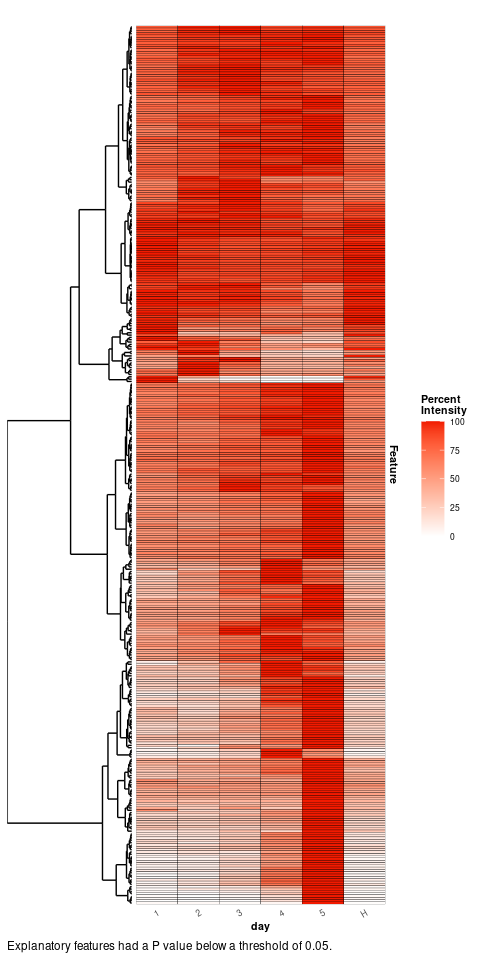

<!-- README.md is generated from README.Rmd. Please edit that file -->

# metabolyseR

[](http://www.repostatus.org/#active)
[](https://github.com/jasenfinch/metabolyseR/actions)
[](https://codecov.io/gh/jasenfinch/metabolyseR/branch/master)
[](https://github.com/jasenfinch/metabolyseR/blob/master/DESCRIPTION)

This package provides a tool kit for pre-treatment, modelling, feature
selection and correlation analyses of metabolomics data.

## Installation

``` r
devtools::install_github('jasenfinch/metabolyseR',build_vignettes = TRUE)
```

## Vignettes

Available vignettes for package usage can be found using the following:

``` r
browseVignettes('metabolyseR')
```

## Quick start example analysis

This example analysis will use the `abr1` data set from the
[metaboData](https://github.com/aberHRML/metaboData) package. It is
nominal mass flow-injection mass spectrometry (FI-MS) fingerprinting
data from a plant-pathogen infection time course experiment. The
analysis will also include use of the pipe `%>%` from the
[magrittr](https://cran.r-project.org/web/packages/magrittr/index.html)
package. First load the necessary packages.

``` r
library(metabolyseR)
library(metaboData)
```

For this example we will use only the negative acquisition mode data
(`abr1$neg`) and sample meta-information (`abr1$fact`). Create an
`AnalysisData` class object using the following:

``` r
d <- analysisData(abr1$neg,abr1$fact)
```

The data includes 120 samples and 2000 mass spectral features as shown
below.

``` r
d
#> 
#> AnalysisData object containing:
#> 
#> Samples: 120 
#> Features: 2000 
#> Info: 9
```

The `clsAvailable()` function can be used to identify the columns
available in our meta-information table.

``` r
clsAvailable(d)
#> [1] "injorder" "pathcdf"  "filecdf"  "name.org" "remark"   "name"     "rep"     
#> [8] "day"      "class"
```

For this analysis, we will be using the infection time course class
information contained in the `day` column. This can be extracted and the
class frequencies tabulated using the following:

``` r
d %>%
  clsExtract(cls = 'day') %>%
  table()
#> .
#>  1  2  3  4  5  H 
#> 20 20 20 20 20 20
```

As can be seen above, the experiment is made up of six infection time
point classes that includes a healthy control class (`H`) and five day
infection time points (`1-5`), each with 20 replicates.

For data pre-treatment prior to statistical analysis, a two-thirds
maximum class occupancy filter can be applied. Features where the
maximum proportion of non-missing data per class is above two-thirds are
retained. A total ion count normalisation will also be applied.

``` r
d <- d %>%
  occupancyMaximum(cls = 'day', occupancy = 2/3) %>%
  transformTICnorm()
```

``` r
d
#> 
#> AnalysisData object containing:
#> 
#> Samples: 120 
#> Features: 1760 
#> Info: 9
```

This has reduced the data set to 1760 relevant features.

The structure of the data can be visualised using both unsupervised and
supervised methods. For instance, the first two principle components
from a principle component analysis (PCA) of the data with the sample
points coloured by infection class can be plotted using:

``` r
plotPCA(d,cls = 'day',xAxis = 'PC1',yAxis = 'PC2')
```


And similarly, multidimensional scaling (MDS) of sample proximity values
from a supervised random forest classification model along with receiver
operator characteristic (ROC) curves.

``` r
plotSupervisedRF(d,cls = 'day')
```


A progression can clearly be seen from the earliest to latest infected
time points.

For feature selection, one-way analysis of variance (ANOVA) can be
performed for each feature to identify features significantly
explanatory for the infection time point.

``` r
anova_results <- d %>%
  anova(cls = 'day')
```

A table of the significantly explanatory features can be extracted with
a bonferroni correction adjusted p value \< 0.05 using:

``` r
explan_feat <- explanatoryFeatures(anova_results,threshold = 0.05)
```

``` r
explan_feat
#> # A tibble: 379 x 10
#>    Response Comparison Feature term     df    sumsq   meansq statistic  p.value
#>    <chr>    <chr>      <chr>   <chr> <dbl>    <dbl>    <dbl>     <dbl>    <dbl>
#>  1 day      1~2~3~4~5… N113    resp…     5 2.16e- 8 4.32e- 9     24.5  1.07e-16
#>  2 day      1~2~3~4~5… N115    resp…     5 2.96e- 8 5.93e- 9     22.0  2.20e-15
#>  3 day      1~2~3~4~5… N117    resp…     5 1.01e- 8 2.02e- 9     28.6  1.11e-18
#>  4 day      1~2~3~4~5… N119    resp…     5 1.74e- 8 3.48e- 9     54.8  9.33e-29
#>  5 day      1~2~3~4~5… N130    resp…     5 4.60e-10 9.19e-11     18.7  1.46e-13
#>  6 day      1~2~3~4~5… N131    resp…     5 4.19e- 9 8.38e-10      7.34 5.39e- 6
#>  7 day      1~2~3~4~5… N132    resp…     5 2.89e- 9 5.79e-10     10.4  2.95e- 8
#>  8 day      1~2~3~4~5… N133    resp…     5 7.00e- 5 1.40e- 5    126.   8.63e-45
#>  9 day      1~2~3~4~5… N137    resp…     5 2.25e- 8 4.49e- 9     37.7  1.21e-22
#> 10 day      1~2~3~4~5… N139    resp…     5 5.06e- 9 1.01e- 9     16.2  4.83e-12
#> # … with 369 more rows, and 1 more variable: adjusted.p.value <dbl>
```

The ANOVA has identified 379 features significantly explanatory over the
infection time course. A heat map of the mean relative intensity for
each class of these explanatory features can be plotted to visualise
their trends between the infection time point classes.

``` r
plotExplanatoryHeatmap(anova_results,
                       threshold = 0.05,
                       featureNames = FALSE)
```



Many of the explanatory features can be seen to be most highly abundant
in the final infection time point `5`.

Finally, box plots of the trends of individual features can be plotted,
such as the `N341` feature below.

``` r
plotFeature(d,feature = 'N341',cls = 'day')
```


